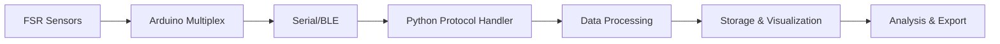

# 
<!-- Modern Animated Banner Header -->
<div align="center">
  
  
  <!-- Animated Typing -->
  

  <!-- Badges -->
  <p>
    
    
    
    
  </p>

  <!-- Project Stats -->
  <p>
    
    
    
  </p>
</div>

---

<table>
<tr>
<td width="50%" valign="top">

## 🌍 About / Acerca del Proyecto

<details open>
<summary><b>🇬🇧 English</b></summary>

### 📊 Project Overview

**FSR-Study-GUI** is a comprehensive platform for working with **Force Sensing Resistors (FSR)**. This project provides researchers, engineers, and students with powerful tools for sensor calibration, data acquisition, real-time visualization, and analysis.

### 🎯 Key Features

- **🖥️ User-Friendly GUI**: Intuitive interface built with PyQt5/Tkinter for easy operation
- **📈 Real-Time Visualization**: Live plotting of force and resistance measurements
- **🔬 Calibration Tools**: Built-in calibration protocols and curve fitting algorithms
- **💾 Data Management**: Automated data logging and export capabilities
- **🤖 Arduino Integration**: Seamless communication with FSR sensor arrays
- **📊 Analysis Scripts**: Post-processing tools for advanced data analysis
- **🎨 3D Design Files**: Included CAD models for sensor mounting and testing fixtures

### 🚀 Applications

- Prosthetic pressure mapping and analysis
- Robotic tactile sensing research
- Human-machine interface development
- Biomechanics and gait analysis
- Industrial force monitoring systems

### 📐 Technical Specifications

- **Sensor Support**: Compatible with FSR 402, FSR 406, and custom arrays
- **Sampling Rate**: Up to 1000 Hz (hardware dependent)
- **Data Format**: CSV, JSON, and HDF5 export options
- **Calibration Methods**: Linear, polynomial, and logarithmic fitting

</details>

<details>
<summary><b>🇪🇸 Español</b></summary>

### 📊 Descripción del Proyecto

**FSR-Study-GUI** es una plataforma integral para trabajar con **Resistores Sensibles a la Fuerza (FSR)**. Este proyecto proporciona a investigadores, ingenieros y estudiantes herramientas poderosas para calibración de sensores, adquisición de datos, visualización en tiempo real y análisis.

### 🎯 Características Principales

- **🖥️ Interfaz Amigable**: Interfaz intuitiva construida con PyQt5/Tkinter para fácil operación
- **📈 Visualización en Tiempo Real**: Gráficas en vivo de mediciones de fuerza y resistencia
- **🔬 Herramientas de Calibración**: Protocolos de calibración integrados y algoritmos de ajuste de curvas
- **💾 Gestión de Datos**: Registro automático de datos y capacidades de exportación
- **🤖 Integración con Arduino**: Comunicación fluida con arreglos de sensores FSR
- **📊 Scripts de Análisis**: Herramientas de post-procesamiento para análisis avanzado de datos
- **🎨 Archivos de Diseño 3D**: Modelos CAD incluidos para montaje de sensores y fixtures de prueba

### 🚀 Aplicaciones

- Mapeo de presión y análisis de prótesis
- Investigación en sensores táctiles robóticos
- Desarrollo de interfaces humano-máquina
- Biomecánica y análisis de la marcha
- Sistemas industriales de monitoreo de fuerza

### 📐 Especificaciones Técnicas

- **Soporte de Sensores**: Compatible con FSR 402, FSR 406 y arreglos personalizados
- **Frecuencia de Muestreo**: Hasta 1000 Hz (dependiente del hardware)
- **Formato de Datos**: Opciones de exportación CSV, JSON y HDF5
- **Métodos de Calibración**: Ajuste lineal, polinomial y logarítmico

</details>

---

## 📂 Repository Structure

```
FSR-Study-GUI/
├── 📁 .github/
│   └── workflows/           # GitHub Actions CI/CD
├── 📁 .vscode/              # VS Code configuration
├── 📁 Code/                 # Python source code
│   ├── Calibracion_Multiplex/   # Calibration modules
│   ├── Com_Protocol_v1/         # Communication protocol v1
│   ├── Comunication/            # Serial communication handlers
│   ├── Process/                 # Data processing scripts
│   ├── Test/                    # Test suites
│   ├── Protocol.py              # Main protocol implementation
│   └── ble_gui.py               # Bluetooth GUI application
├── 📁 Data/                 # Experimental datasets
│   ├── sensor0/             # Sensor 0 measurements
│   ├── sensor1/             # Sensor 1 measurements
│   ├── sensor2/             # Sensor 2 measurements
│   ├── sensor3/             # Sensor 3 measurements
│   └── operacion.csv        # Operation log data
├── 📁 Design/               # CAD files and 3D models
│   ├── *.ipt                # Autodesk Inventor parts
│   ├── *.stl                # 3D printable models
│   └── *.gcode              # Manufacturing G-code
├── 📁 Img/                  # Images and diagrams
├── 📁 Processed/            # Processed data outputs
├── 📁 Sources/              # Arduino firmware
│   └── Calibracion_Multiplex.ino  # Multiplex calibration code
├── 📄 FSR SyA UNAL.pdf      # Project documentation
├── 📄 FSR402-Sensor-Datasheet.pdf  # FSR402 sensor specs
├── 📄 LICENSE               # MIT License
├── 📄 README.md             # This file
└── 📄 requirements.txt      # Python dependencies
```

---

## 🛠️ Technology Stack

<div align="center">

### Core Technologies
<p>
  
</p>

### Libraries & Frameworks
<p align="center">
  
  
  
  
  
</p>

### Design Tools
<p align="center">
  
  
  
</p>

</div>

</td>

<!-- Right Column -->
<td width="50%" valign="top">

## 🚀 Quick Start Guide

### 📋 Prerequisites

- Python 3.8 or higher
- Arduino IDE (for sensor firmware)
- Git installed on your system
- USB drivers for Arduino boards

### ⚡ Installation

1. **Clone the repository**
   ```bash
   git clone https://github.com/Protsen-UN/FSR-Study-GUI.git
   cd FSR-Study-GUI
   ```

2. **Create virtual environment** (recommended)
   ```bash
   # Windows (PowerShell)
   python -m venv venv
   .\venv\Scripts\Activate.ps1

   # Windows (CMD)
   .\venv\Scripts\activate.bat

   # macOS / Linux
   python3 -m venv venv
   source venv/bin/activate
   ```

3. **Install dependencies**
   ```bash
   pip install -r requirements.txt
   ```

4. **Upload Arduino firmware**
   - Open `Sources/Calibracion_Multiplex.ino` in Arduino IDE
   - Select your board and COM port
   - Upload to your Arduino

5. **Run the GUI**
   ```bash
   python Code/ble_gui.py
   ```

6. **Run protocol tests**
   ```bash
   python Code/Protocol.py
   ```

---

## 📊 Usage Examples

### 🔬 Basic Calibration Workflow

```python
# Import from the Code directory
from Code.Comunication import serial_handler
from Code.Process import data_processor

# Initialize serial communication
serial_conn = serial_handler.connect(port='COM3', baudrate=115200)

# Start calibration process
calibrator = data_processor.Calibrator(
    sensors=[0, 1, 2, 3],  # 4 FSR sensors
    force_range=(0, 100),   # Newtons
    samples_per_point=100
)

# Run calibration
calibrator.run()

# Export results
calibrator.export('Data/calibration_results.csv')
```

### 📈 Real-Time Monitoring with BLE GUI

```python
# Launch the Bluetooth Low Energy GUI
from Code import ble_gui

# Start the application
app = ble_gui.FSRMonitorApp()
app.run()

# The GUI will:
# - Scan for BLE devices
# - Connect to FSR sensor array
# - Display real-time force data
# - Log measurements to Data/ directory
```

### 🔌 Using Communication Protocol

```python
from Code.Protocol import FSRProtocol

# Initialize protocol handler
protocol = FSRProtocol(port='COM3')

# Request sensor data
sensor_data = protocol.read_sensors()

# Process multiplex data
for sensor_id, readings in sensor_data.items():
    print(f"Sensor {sensor_id}: {readings}")
```

---

## 🧪 Experimental Guidelines

### ⚠️ Best Practices

- ✅ Calibrate sensors before each experiment
- ✅ Verify linearity within your force range
- ✅ Use consistent loading conditions
- ✅ Log environmental conditions (temperature, humidity)
- ✅ Run multiple trials for statistical significance
- ✅ Check FSR402 datasheet for sensor specifications

### 📚 Documentation Files

The repository includes essential documentation:

- **FSR SyA UNAL.pdf** - Complete project documentation and research findings
- **FSR402-Sensor-Datasheet.pdf** - Official sensor specifications and characteristics

### 🔌 Hardware Setup

#### Arduino Firmware
The `Sources/Calibracion_Multiplex.ino` firmware provides:
- Multiplexed reading of multiple FSR sensors
- Serial communication protocol
- Calibration data acquisition
- Real-time sensor monitoring

#### Wiring Configuration
1. Connect FSR sensors to analog pins (A0-A3)
2. Use voltage divider circuit (10kΩ recommended)
3. Connect ground and power rails
4. USB connection for serial communication

### 📏 Data Organization

Each sensor folder (`sensor0/`, `sensor1/`, etc.) contains:
- Raw measurement data
- Calibration curves
- Time-stamped recordings
- Metadata files

The `operacion.csv` file logs:
- Experimental parameters
- Session information
- Sensor configurations
- Environmental conditions

### 📏 Calibration Protocol

1. **Preparation**: Clean sensor surface and mounting fixture
2. **Zero Load**: Record baseline resistance without force
3. **Incremental Loading**: Apply known forces in steps
4. **Data Collection**: Record resistance at each force level
5. **Curve Fitting**: Apply appropriate calibration model
6. **Validation**: Test with independent force measurements

---

## 💾 Git LFS Setup (Optional)

For large binary files (`.stl`, `.gcode`, `.ipt`):

```bash
# Install Git LFS (one time)
git lfs install

# Track large file extensions
git lfs track "*.stl"
git lfs track "*.gcode"
git lfs track "*.ipt"

# Commit and push
git add .gitattributes
git add Design/*.stl
git commit -m "Track design files with Git LFS"
git push origin main
```

---
</td>
</tr>
</table>

## 🔧 System Architecture

### 📡 Communication Protocols

The system implements multiple communication interfaces:

<div align="center">

| Protocol | Implementation | Use Case |
|----------|---------------|----------|
| **Serial USB** | `Code/Comunication/` | Wired data acquisition |
| **Bluetooth LE** | `Code/ble_gui.py` | Wireless monitoring |
| **Custom Protocol v1** | `Code/Com_Protocol_v1/` | Advanced features |

</div>

### 🔄 Data Flow



### 🖥️ Software Components

<details open>
<summary><b>Code Structure</b></summary>

| Component | Description | Key Files |
|-----------|-------------|-----------|
| **Calibration** | Sensor calibration routines | `Code/Calibracion_Multiplex/` |
| **Communication** | Serial & BLE handlers | `Code/Comunication/`, `Code/Protocol.py` |
| **Processing** | Data analysis & filtering | `Code/Process/` |
| **Testing** | Unit tests & validation | `Code/Test/` |
| **GUI** | Bluetooth interface | `Code/ble_gui.py` |

</details>

### ⚙️ Hardware Components

<details>
<summary><b>Bill of Materials</b></summary>

| Component | Specification | Quantity |
|-----------|--------------|----------|
| FSR Sensors | FSR 402 (0.2"-diameter) | 4+ |
| Microcontroller | Arduino Uno/Nano | 1 |
| Resistors | 10kΩ (voltage divider) | 4+ |
| Bluetooth Module | HC-05/HC-06 or BLE | 1 (optional) |
| Wiring | Jumper wires | As needed |
| Enclosure | 3D printed (see Design/) | 1 |

</details>

---

## 🎯 Research Applications

<div align="center">

<table>
<tr>
<td align="center" width="25%">
  <br/>
  <sub>Pressure mapping for<br/>residual limb analysis</sub>
</td>
<td align="center" width="25%">
  <br/>
  <sub>Tactile sensing for<br/>robotic grippers</sub>
</td>
<td align="center" width="25%">
  <br/>
  <sub>Gait analysis and<br/>force distribution</sub>
</td>
<td align="center" width="25%">
  <br/>
  <sub>Quality control and<br/>force monitoring</sub>
</td>
</tr>
</table>

</div>

---

## 🤝 Contributing

We welcome contributions from the community! Here's how you can help:

<details>
<summary><b>🔧 Development Guidelines</b></summary>

1. **Fork the repository** and create your branch
   ```bash
   git checkout -b feature/amazing-feature
   ```

2. **Make your changes** with clear, descriptive commits
   ```bash
   git commit -m "Add: New calibration algorithm for FSR 406"
   ```

3. **Test thoroughly** - Include test data when applicable
   
4. **Update documentation** - Keep README and docs in sync

5. **Submit a Pull Request** with detailed description

### 📝 Contribution Areas

- 🐛 Bug fixes and error handling
- ✨ New features and enhancements
- 📚 Documentation improvements
- 🧪 Test coverage expansion
- 🎨 UI/UX improvements
- 🌐 Translations and localization

</details>

---

## 👥 Team & Acknowledgements

<div align="center">

### 🌟 Project Lead

**Samuel David Sanchez Cardenas**

[](https://github.com/samsanchezcar)
[](mailto:samsanchezcar@gmail.com)
[](https://linkedin.com/in/samuel-sanchez-cardenas)

---

### 🏛️ Institutional Support


**Universidad Nacional de Colombia**

</div>

### 🙏 Special Thanks

- **Protos UNAL** research team for clinical collaboration and feedback
- **Kyma Lab** for embedded systems expertise
- Contributors, students, and professors supporting research and testing
- Open-source community for libraries and tools that made this possible

---

## 📄 License

<div align="center">

This project is licensed under the **MIT License**

```
MIT License

Copyright (c) 2025 Samuel David Sanchez Cardenas & Protsen-UN

Permission is hereby granted, free of charge, to any person obtaining a copy
of this software and associated documentation files (the "Software"), to deal
in the Software without restriction, including without limitation the rights
to use, copy, modify, merge, publish, distribute, sublicense, and/or sell
copies of the Software, and to permit persons to whom the Software is
furnished to do so, subject to the following conditions:

The above copyright notice and this permission notice shall be included in all
copies or substantial portions of the Software.

THE SOFTWARE IS PROVIDED "AS IS", WITHOUT WARRANTY OF ANY KIND, EXPRESS OR
IMPLIED, INCLUDING BUT NOT LIMITED TO THE WARRANTIES OF MERCHANTABILITY,
FITNESS FOR A PARTICULAR PURPOSE AND NONINFRINGEMENT. IN NO EVENT SHALL THE
AUTHORS OR COPYRIGHT HOLDERS BE LIABLE FOR ANY CLAIM, DAMAGES OR OTHER
LIABILITY, WHETHER IN AN ACTION OF CONTRACT, TORT OR OTHERWISE, ARISING FROM,
OUT OF OR IN CONNECTION WITH THE SOFTWARE OR THE USE OR OTHER DEALINGS IN THE
SOFTWARE.
```

See [`LICENSE`](LICENSE) file for full details.

</div>

---

<!-- Modern Animated Footer -->
<div align="center">
  
  
  ### 💡 *"Precision in measurement leads to excellence in engineering"*
  
  
  
  <sub>⭐ Don't forget to star this repo! • 🔔 Watch for updates • 🍴 Fork to contribute</sub>
  
  <br/><br/>
  
  [](https://github.com/Protsen-UN/FSR-Study-GUI)
</div>
